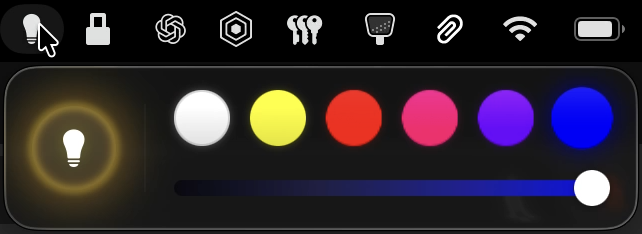

# LampMenuBar

A minimalist macOS menu bar controller for a BLE smart lamp.

## Features
- One-click power toggle
- Quick color presets
- Brightness slider with delayed apply

## Build
Open `LampMenuBar.xcodeproj` in Xcode and run.
